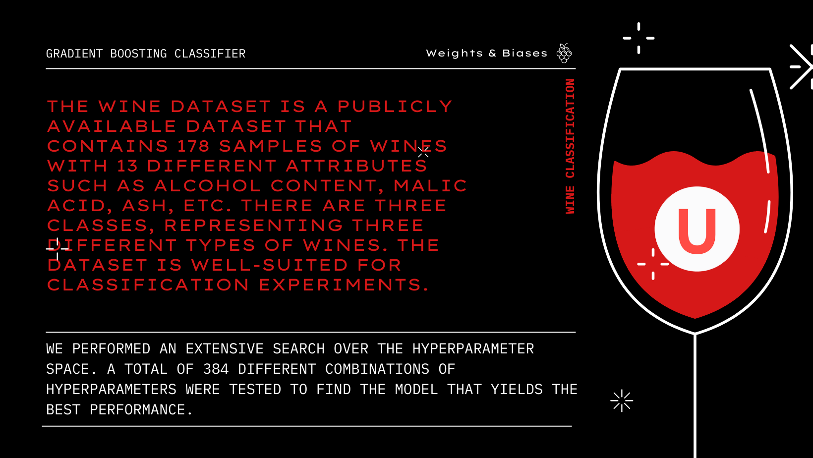

# GradientBoosting-WineClassification-Wandb

 

# Clasificación de Vinos con Aumento de Gradiente: Proyecto en Upgrade Hub       

Bienvenido al repositorio del proyecto de experimentación para la clase de Ciencia de Datos en Upgrade Hub. En este proyecto, exploramos el uso de ponderaciones y sesgos para ajustar y evaluar sistemáticamente los hiperparámetros de un clasificador de aumento de gradiente utilizando el conjunto de datos Wine.

### Resultados de la Experimentación:

Los resultados detallados de la experimentación se encuentran disponibles en el panel de Ponderaciones y Sesgos. Aquí, se presentan diversas métricas de rendimiento, incluida la precisión, junto con los hiperparámetros utilizados en cada experimento.

🔗 https://wandb.ai/iraitzete/vinito-upgrade/reports/GradientBoosting-WineClassification-Wandb---Vmlldzo1ODk3MjE2

### Descripción del Problema:

Nos enfrentamos a un problema clásico de clasificación multiclase: predecir la categoría del vino según atributos fisicoquímicos. El conjunto de datos Wine, con 178 muestras y 13 atributos, es utilizado en las practicas de aprendizaje automático.

### Conjunto de Datos:

Wine consta de 178 muestras de vinos, cada una con 13 atributos diferentes, como contenido de alcohol, ácido málico y cenizas. Hay tres clases que representan distintos tipos de vinos, haciéndolo adecuado para experimentos de clasificación.

### Experimentación:

Utilizamos el Gradient Boosting Classifier, un algoritmo de aprendizaje automático de conjuntos basado en árboles de decisión. Exploramos diversas combinaciones de hiperparámetros como tasa de aprendizaje, profundidad máxima de árboles y número de estimadores.

Integración de Weights & Biases

Integramos Weights & Biases en nuestro pipeline para registrar hiperparámetros y métricas. Esto nos proporciona un cuadro de mando interactivo para visualizar y analizar los resultados.

Ajuste de Hiperparámetros y Mejor Modelo        

Con una búsqueda exhaustiva de 384 combinaciones de hiperparámetros, encontramos el modelo óptimo con una precisión del 98.15%. Los hiperparámetros ajustados incluyen tasa de aprendizaje, profundidad máxima, número de estimadores y más.

### Mejor Modelo:

Tasa de aprendizaje: 0.1      

Función de pérdida: desviación                                                    

Profundidad máxima: 3                                                    

Min_samples_leaf: 2                                                        

Min_samples_split: 2                                                               

Número de estimadores: 50                                                       

Submuestra: 1                                                         

Este modelo altamente preciso demuestra eficacia en clasificar correctamente las muestras de vino.

Ejecución del Código                                             

Asegúrate de tener todas las dependencias instaladas para ejecutar el código.

